# [Trust Marketplace](https://trust-market.netlify.app/)

Trust Marketplace ([view pitch](https://www.youtube.com/watch?v=J3zUxvo8ZBs)) isn't just another gig platform—it's a rethinking of trust in digital conversations ([view webapp](https://trust-market.netlify.app/)). As if you Chat with strangers, hire them, and a Guardian Angel, called Trust, makes sure you're never scammed for huge $$$s. 
Is this impossible? Who's the Angel? How do they do their tough job? 

Often - monetary Trust - this strong - is governed by centralized institutions, but imagine it emerges directly from cryptographic and blockchain-driven mechanisms. This is precisely what Trust Marketplace brings to the table.

Built atop the Sui blockchain, our peer-to-peer gig protocol integrates on-chain escrow, cryptographically enforced privacy (via AES-GCM encryption and [Seal protocol](https://github.com/avalias/trust_market/blob/e506eb338b55777a473eaed5bda024a613b596b3/frontend/src/utils.ts#L79)), a Chat with decentralized file storage ([Walrus](https://github.com/avalias/trust_market/blob/e506eb338b55777a473eaed5bda024a613b596b3/frontend/src/utils.ts#L564)), and an on-chain reputation system (to be finished). The protocol doesn't rely on conventional assumptions —everything is algorithmically provable and enforced by [smart contract state](move/sources/marketplace.move) and cryptographic primitives.

[//]: # (> **Vision:** Trust Marketplace transcends gig work; it’s a composable trust engine. Its primitives—escrow, dispute resolution, cryptographic access control, and reputation management—are foundational building blocks for a broader, decentralized ecosystem. Think of it as the TCP/IP of decentralized trust.)

## Table of Contents

- [How It Works](#how-it-works)
- [Architecture](#architecture)
- [Smart Contract Logic](#smart-contract-logic)
- [Cryptography & Access Control](#cryptography--access-control)
- [Core User Flows & UI](#core-user-flows--ui)
- [Frontend & Developer Experience](#frontend--developer-experience)
- [Deployment & Configuration](#deployment--configuration)
- [Research & Roadmap](#research--roadmap)
- [Getting Started](#getting-started)
- [License](#license)

---

## How It Works

### 1. Creating & Joining Gigs

- 📝 **Create:** A seller creates an advertisement directly on-chain ([`create_advertisement_entry`](https://github.com/avalias/trust_market/blob/e506eb338b55777a473eaed5bda024a613b596b3/move/sources/marketplace.move#L161)) with transparent pricing and clear deliverables.
- 🤝 **Join:** A buyer joins by locking payment securely into a smart contract escrow. An ephemeral AES-GCM key is generated in-browser and encrypted using [Seal's threshold cryptography](frontend/src/utils.ts).
- 🔑 **Key Exchange:** Keys are encrypted and stored on-chain, strictly accessible only by transaction participants.

### 2. Secure Communication

- 💬 **Chat:** All interactions—messages and files—are client-side encrypted using [AES-GCM](https://github.com/avalias/trust_market/blob/e506eb338b55777a473eaed5bda024a613b596b3/frontend/src/utils.ts#L278) and transmitted via blockchain state references. Files are stored on [Walrus](https://github.com/avalias/trust_market/blob/e506eb338b55777a473eaed5bda024a613b596b3/frontend/src/utils.ts#L240), with metadata   inside the binary blob file, everything encrypted together. The decentralized storage blobId is [linked to gig interactions](https://github.com/avalias/trust_market/blob/e506eb338b55777a473eaed5bda024a613b596b3/move/sources/marketplace.move#L420). Upon decryption
- 🔒 **Privacy:** Cryptographic acess control rules, written in the ([`seal_approve`](https://github.com/avalias/trust_market/blob/e506eb338b55777a473eaed5bda024a613b596b3/move/sources/marketplace.move#L632)) of the smart-contract ensure that only gig participants can decrypt messages. Platform operators remain completely blind unless explicitly granted access during disputes.

### 3. Escrow & Dispute Resolution

- ✅ **Completion:** The seller marks the gig complete; the buyer approves and releases payment from escrow ([`mark_completed_entry`, `release_payment_entry`](https://github.com/avalias/trust_market/blob/e506eb338b55777a473eaed5bda024a613b596b3/move/sources/marketplace.move#L324)).
- ⚡ **Disputes:** Either party can invoke a dispute. A decentralized, on-chain mechanism randomly selects an admin to arbitrate ([`select_random_admin`](https://github.com/avalias/trust_market/blob/e506eb338b55777a473eaed5bda024a613b596b3/move/sources/marketplace.move#L226)).
- 🕵️ **Admin Oversight:** Admins gain cryptographically verifiable access only to disputed interactions, controlled by smart contract logic ([`seal_approve`](https://github.com/avalias/trust_market/blob/e506eb338b55777a473eaed5bda024a613b596b3/move/sources/marketplace.move#L632)).

### 4. Reputation System

- 🌟 **Reviews:** Under development. Post-interaction ratings, reviews, deal volume, and dispute statistics accumulate transparently on-chain, forming immutable and composable reputation profiles ([`UserReputation`](move/sources/marketplace.move)).

---

## Architecture

```mermaid
graph TD
  UI[🖥️ React + TypeScript Frontend] -->|Wallet, API, Chat| Sui[📝 Move Smart Contracts]
  UI -->|Encrypt/Decrypt| Seal[🔑 Seal Protocol]
  UI -->|Upload/Download| Walrus[🗄️ Walrus Storage]
  Sui -->|Escrow, Disputes, Reputation| Chain[⛓️ Sui Blockchain]
  Walrus -->|Blob IDs| Sui
```



- **Frontend:** [React and TypeScript](frontend/src/), wallet interactions via @mysten/dapp-kit, Radix UI for component modularity.
- **Smart Contracts:** Written in [Move](move/sources/marketplace.move), providing explicit state machines for advertisements, escrow, chat management, and reputation.
- **Cryptography:** AES-GCM ephemeral keys encrypted with [Seal (2-of-N threshold scheme)](frontend/src/utils.ts) per interaction.
- **Decentralized Storage:** [Walrus](frontend/src/utils.ts) provides censorship-resistant, decentralized file storage.

---

## Smart Contract Logic

- **Explicit State Machines:**  
  Interactions and advertisements progress through precisely defined states, enforced rigorously by Move contract assertions ([`Advertisement`, `Interaction`](move/sources/marketplace.move)).
- **Robust Escrow:**  
  Funds locked securely in Coin<SUI>, only releasable through verifiable protocol state transitions ([`mark_completed_entry`, `release_payment_entry`](move/sources/marketplace.move)).
- **Decentralized Dispute Arbitration:**  
  Cryptographic randomness selects admins transparently; enforced via [`seal_approve`](move/sources/marketplace.move) access control primitives.
- **On-Chain Access Control:**  
  Access policies (namespace validations via [`is_prefix`](move/sources/utils.move)) are mathematically guaranteed within smart contract logic.
- **Immutable Reputation:**  
  Reputation scores are transparently calculated and maintained on-chain ([`UserReputation`](move/sources/marketplace.move)).

---

## Cryptography & Access Control

- **Ephemeral Encryption Keys:**  
  Unique, ephemeral 32-byte AES keys generated client-side per interaction, Sealed🦭 securely on-chain via threshold cryptography ([`generateAndEncryptEphemeralKey`](frontend/src/utils.ts)).
- **End-to-End Encrypted Communication:**  
  All messages and files protected by AES-GCM encryption; decrypted solely by interaction participants or assigned dispute admins ([`ChatWrapper.tsx`](frontend/src/components/ChatWrapper.tsx), [`ChatContext.tsx`](frontend/src/contexts/ChatContext.tsx)).
- **No Persistent Local Storage:**  
  All cryptographic guarantees reside entirely on-chain—nothing relies on client-side storage or off-chain assumptions.

---

## Core User Flows & UI

### Gig and Interaction Management

- **[AdvertisementDetail.tsx](frontend/src/AdvertisementDetail.tsx):** Clearly presents gig state, details, and user interactions.
- **[InteractionsList.tsx](frontend/src/InteractionsList.tsx):** Users can monitor all deals, filter by status, and engage seamlessly with secure chat.
- **[ChatWrapper.tsx](frontend/src/components/ChatWrapper.tsx):** Real-time secure communications, robust session management, integrated directly into the gig workflow.

> **Note:** Notification center, advanced admin management UI, and reputation system are under development.

---

## Frontend & Developer Experience

- **Type Safety:**  
  Frontend mirrors Move contract definitions ([`types.ts`](frontend/src/types.ts)), ensuring strict consistency across all components.
- **Composable UI Components:**  
  Modular React components simplify development and encourage ecosystem integration.
- **Efficient Deployment Pipeline:**  
  Automated scripts ([`deploy.js`](move/deploy.js)) synchronize frontend and smart contract deployments.
  Clear separation between Devnet, Testnet, and Mainnet ([`constants.ts`](frontend/src/constants.ts)) is maintained.

---

## Research & Roadmap

- **Decentralized Admin Registry:**  
  Future governance includes DAO-driven admin selection (voting of governors to select best people or to banish an evil admin;))
- **Zero-Knowledge Integration:**  
  zkLogin-based reputation verification will tie decentralized trust directly to provable social identities (Google Account e.t.c.).
- **Composable Reputation:**  
  Reputation scores will become portable across various dApps inside Sui ecosystem.
- **Ecosystem Composability:**  
  Escrow and encrypted chat primitives will be standardized like wallet-adapters to use in any dApp.
  It means a wallet-connect like plug&play hooks to drop-in Seal encrypted Chats everywhere.
---

## Getting Started

### Prerequisites

- Node.js v18+
- pnpm
- Sui CLI ([docs](https://docs.sui.io/build/install)), install with homebrew is a breeze!
- [Slush wallet](https://chromewebstore.google.com/detail/slush-%E2%80%94-a-sui-wallet/opcgpfmipidbgpenhmajoajpbobppdil) is top.
  
### Setup

```bash
git clone https://github.com/avalias/trust-marketplace
cd trust-marketplace/frontend
pnpm install
pnpm run dev
```

Ensure your Sui Testnet wallet has test tokens available via [faucet](https://faucet.sui.io/).

---

## License

MIT

---

Trust Marketplace integrates cutting-edge cryptographic protocols ([Seal](frontend/src/utils.ts)), established cryptographic primitives like AES-GCM, decentralized blob storage on Walrus, and robust on-chain mechanisms ([Move smart contracts](move/sources/marketplace.move)). Every aspect of security, privacy, access control and dispute resolution is backed by explicit cryptogtaphy and algorithms, setting a new standard for decentralized escrow and p2p Chats.

The project is open to extension and research in decentralized trust, composable reputation, and cryptographic dispute resolution.
